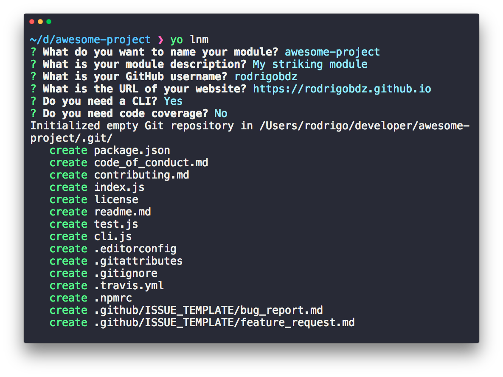

# generator-lnm [](https://travis-ci.com/rodrigobdz/generator-lnm)

> Awesome Node module generator

### Features

Improvements **generator-lnm** over generator-nm:

* Generated modules comply with [recommended community standards](https://opensource.guide).
* Optionally with a [CLI](http://en.wikipedia.org/wiki/Command-line_interface) which includes [update notifier](https://github.com/yeoman/update-notifier).

This is what I use for [my own modules](https://www.npmjs.com/~rodrigobdz).



## Install

```sh
$ npm install --global yo generator-lnm
```

## Usage

With [yo](https://github.com/yeoman/yo):

```sh
$ yo lnm
```

There are multiple command-line options available:

```sh
$ yo lnm --help

  Usage:
    yo lnm [options]

  Options:
    --help          # Print the generator's options and usage
    --skip-cache    # Do not remember prompt answers                      Default: false
    --skip-install  # Do not automatically install dependencies           Default: false
    --org           # Publish to a GitHub organization account
    --cli           # Add a CLI
    --coverage      # Add code coverage with nyc
    --codecov       # Upload coverage to codecov.io (implies --coverage)
```

The `--org` option takes a string value (i.e. `--org=avajs`). All others are boolean flags and can be negated with the `no` prefix (i.e. `--no-codecov`). You will be prompted for any options not passed on the command-line.

### Tip

Use [chalk](https://github.com/sindresorhus/chalk) if you want colors in your CLI.

## Related projects

[sindresorhus/generator-nm](https://github.com/sindresorhus/generator-nm) - generator-lnm is forked from generator-nm. _lnm_ stands for _**l**inted **n**ode **m**odule_. Reasons for forking:

* Linted markdown files
* License includes line breaks to improve readability.
* Link to license file in license section

See [changelog](changelog.md#100---2019-03-01), [PR #78](https://github.com/sindresorhus/generator-nm/pull/78) and [PR #79](https://github.com/sindresorhus/generator-nm/pull/79) for reference.

## Credits

This readme is based on [rodrigobdz/minimal-readme](https://github.com/rodrigobdz/minimal-readme).

## License

[MIT](license) © [rodrigobdz](https://rodrigobdz.github.io)
